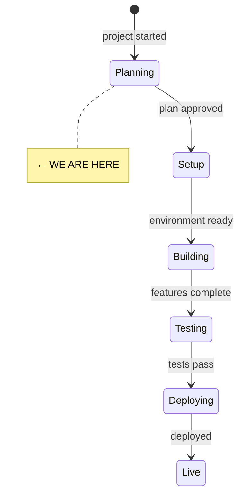
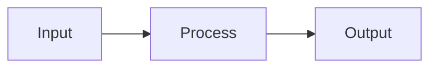

# State

> Last updated: 2026-04-12

## System State Diagram

Update this diagram as the project progresses. Move the `← WE ARE HERE` marker. Add substates for complex phases.

## Component Status

| Component | Status | Notes |
|-----------|--------|-------|
| [Component 1] | ⏳ Not started | |
| [Component 2] | ⏳ Not started | |
| [Component 3] | ⏳ Not started | |

Status markers:
- ⏳ Not started
- 🔧 In progress
- ✅ Done
- 🚫 Blocked — note why
- ⚠️ Needs attention

## Data Flow

Add a data flow or architecture diagram when the system has multiple components that interact.

## Dependencies

| Dependency | Status | Notes |
|------------|--------|-------|
| [External API / service] | [Working / Down / Not set up] | |
| [Database] | | |

<!--
Keep this file as the single source of truth for "where are we?"
The /status command reads this file.
-->
