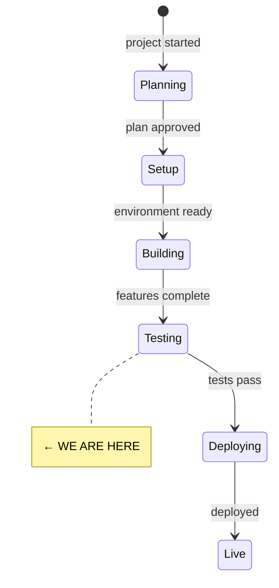
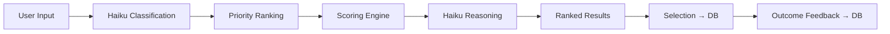
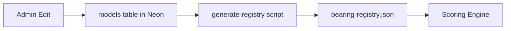

# State

> Last updated: 2026-04-13

## System State Diagram

## Component Status

| Component | Status | Notes |
|-----------|--------|-------|
| Registry loader | Done | 29 models, typed, tested |
| Weight conversion | Done | Blended rank/default approach, tested |
| Scoring engine | Done | 7-factor, pure function, tested |
| Classification (Haiku) | Done | Prompt in src/prompts/classify.md |
| Reasoning (Haiku) | Done | Prompt in src/prompts/reason.md |
| Database schema | Done | 4 migrations (001-initial, 002-magic-tokens, 003-models, 004-admin-flag) |
| Server actions | Done | Recommend + Compare + Admin CRUD |
| Home page | Done | Mode tabs, task input |
| Clarification page | Done | Tappable options, 2-round max |
| Priority ranking | Done | Drag + tap-to-move, 7 factors |
| Results page | Done | Ranked cards, factor bars, reasoning |
| Feedback page | Done | Thumbs + failure reasons |
| Models registry | Done | Grid + detail, DB-first with JSON fallback |
| About page | Done | Privacy, open source, Good Ship |
| Validate mode | Done | Model autocomplete, 3-state assessment |
| Compare mode | Done | OpenRouter dual calls, preference vote, PDF/CSV attachments |
| Public dataset | Done | JSON + CSV APIs, /data page |
| Models table (DB) | Done | Migration 003 applied to Neon |
| Admin flag | Done | Migration 004 applied to Neon |
| Seed script | Done | scripts/seed-models.ts (JSON → DB) |
| Generate script | Done | scripts/generate-registry.ts (DB → JSON), prebuild hook |
| Admin UI | Done | List page + edit/create with structured forms |
| Admin dashboard | Done | Usage + Insights tabs with Recharts charts |
| OpenRouter discover | Done | Discover tab with import, AI estimation, pricing sync |

## Data Flow

## Dependencies

| Dependency | Status | Notes |
|------------|--------|-------|
| Neon Postgres | Needs migration | Migrations 003 + 004 ready to run |
| Anthropic API | Ready | Key available for Haiku classification |
| OpenRouter API | Ready | Key available for Compare mode |
| Vercel | Not deployed | Build passes, ready to deploy |
| dotenv | Added | Dev dependency for build scripts |
| tsx | Added | Dev dependency for TypeScript build scripts |
