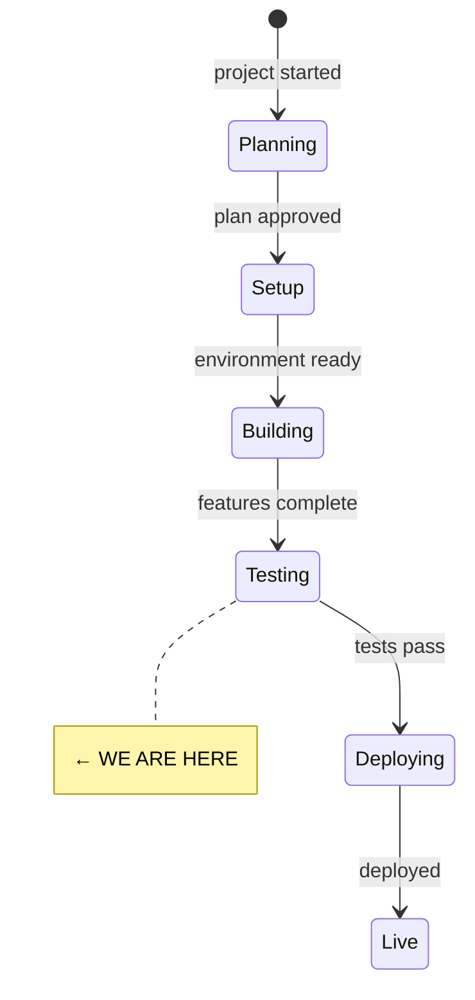
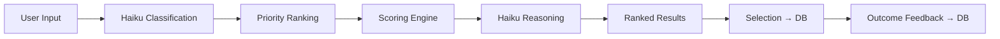

# State

> Last updated: 2026-04-12

## System State Diagram

## Component Status

| Component | Status | Notes |
|-----------|--------|-------|
| Registry loader | ✅ Done | 17 models, typed, tested |
| Weight conversion | ✅ Done | Blended rank/default approach, tested |
| Scoring engine | ✅ Done | 7-factor, pure function, tested |
| Classification (Haiku) | ✅ Done | Prompt in src/prompts/classify.md |
| Reasoning (Haiku) | ✅ Done | Prompt in src/prompts/reason.md |
| Database schema | ✅ Done | Migration ready, lazy connection |
| Server actions | ✅ Done | 6 actions for full recommend flow |
| Home page | ✅ Done | Mode tabs, task input |
| Clarification page | ✅ Done | Tappable options, 2-round max |
| Priority ranking | ✅ Done | Drag + tap-to-move, 7 factors |
| Results page | ✅ Done | Ranked cards, factor bars, reasoning |
| Feedback page | ✅ Done | Thumbs + failure reasons |
| Models registry | ✅ Done | Grid + detail pages for all 17 |
| About page | ✅ Done | Privacy, open source, Good Ship |
| Validate mode | ⏳ Not started | Sprint 2 |
| Compare mode | ⏳ Not started | Sprint 3 |
| Public dataset | ⏳ Not started | Sprint 3 |
| Visual design | ⏳ Not started | Use impeccable/frontend-design |

## Data Flow

## Dependencies

| Dependency | Status | Notes |
|------------|--------|-------|
| Neon Postgres | Not set up | Migration ready, need to run against real DB |
| Anthropic API | Ready | Key available for Haiku classification |
| OpenRouter API | Ready | Key available for Compare mode (Sprint 3) |
| Vercel | Not deployed | Build passes, ready to deploy |
