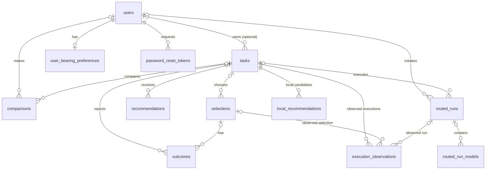
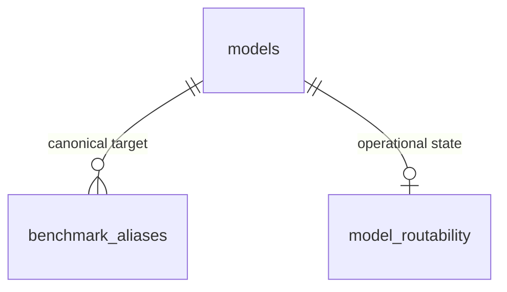

# Bearing's data model

This is a **readable map of the versioned SQL migrations**, not a snapshot of the live Neon database. It lets contributors understand and propose changes **without database credentials**.

**Where to look:** `src/db/migrations/` contains the SQL history; `src/db/` holds domain-specific data access; `src/data/bearing-registry.json` is a generated catalogue snapshot; and [the public data model](../public-data.md) describes the **export contract**, which is not the same as the internal schema.

The diagrams distinguish **enforced foreign keys** from **logical model-slug references**. Do not infer a database constraint merely because the application joins two fields.

## 1. Decisions, tasks and outcomes

| Table | Why it exists | Notes |
| --- | --- | --- |
| `users` | Account identity and password state | User emails and authentication are private; not part of open evidence exports. |
| `tasks` | Structured task characteristics, optional owner and classification | Raw task descriptions are not required for the learning dataset. |
| `recommendations` | Ranked model suggestions and factor scores for each task | `model_slug` is a logical reference, **not** a foreign key. |
| `local_recommendations` | Predicted local-running candidates and hardware tier per task | A prediction does not prove execution. |
| `selections` | Which model a person chose | Optional choice context and model metadata snapshot. |
| `outcomes` | Success/failure and optional feedback | May reference a task and a selection. |
| `comparisons` | Pairwise model preferences | Two model-slug strings, not enforced model foreign keys. |
| `routed_runs` | Route / Trio / Challenger sessions | Judge and human choices are stored separately. |
| `routed_run_models` | Models attempted within a routed run | Model slug, rank, role, hashes, error and performance metadata. |
| `execution_observations` | Actual runtime evidence | May refer to a selection or routed run; separate from fit estimates. |
| `user_bearing_preferences` | Explicit defaults and learning controls | Keyed by user; user-controlled reset boundary. |
| `password_reset_tokens` | Short-lived password setup/reset flow | Sensitive operational data, never public evidence. |

The original `comparisons` and `routed_runs` designs coexist: manual pairwise comparison is a different shape from a multi-model route.

**Important:** In the ER diagram, a relationship can be optional on one side. Check the SQL before relying on nullability, deletion behaviour, cardinality or cascades. The diagram intentionally shows domain relationships, not every column.

## 2. Catalogue and benchmark evidence

| Table | Why it exists | Notes |
| --- | --- | --- |
| `models` | Canonical model metadata, pricing, ratings, provider IDs, freshness and active state | `slug` is the primary identifier; current canonical records live in the DB. |
| `benchmark_aliases` | Reviewed source-specific name → canonical model slug | FK to `models.slug`. Mapping must distinguish evaluation variants. |
| `benchmark_snapshots` | Dated source measurements, categories and normalised scores | Nullable `bearing_slug` is **not** an FK; unmatched rows can be retained pending review. |
| `model_routability` | Observed runtime state, independent of model capability | Model slug has a FK to `models.slug`. |

`recommendations.model_slug`, `local_recommendations.model_slug`, `comparisons.model_a_slug` and `comparisons.model_b_slug`, `routed_run_models.model_slug`, `execution_observations.model_slug`, and `benchmark_snapshots.bearing_slug` are **logical** model references in the SQL history, not all enforced foreign keys. That distinction matters when proposing renames or deletion rules.

**A current design question:** Should *canonical models*, *provider deployments/routes* and *evaluated benchmark variants* have separate persistent identities? Propose this via a [data-model issue](https://github.com/tomcwxyz/bearing/issues/new/choose), with an example showing where the existing alias approach loses important distinctions. Do not pre-empt ongoing benchmark-variant work with an undocumented schema edit.

## 3. Legacy and pending migrations

`magic_tokens` was introduced for the earlier sign-in flow. The migration named `025_drop_magic_tokens.sql.pending` is deliberately **not** applied by `scripts/run-migrations.ts`, which loads only `*.sql`. Until its retirement is explicitly approved and applied, the legacy table may remain in databases created from current migrations. Do not remove it casually in a contribution.

## 4. Five distinctions worth preserving

1. **Recommendation is not selection:** what Bearing suggested is different from what somebody chose.
2. **Selection is not execution:** predicted hardware fit is not evidence that a model ran.
3. **Benchmark is not model quality:** distinguish source, date, cohort, variant and methodology.
4. **Availability is not capability:** routability and catalogue freshness do not rewrite intrinsic task fitness.
5. **Current metadata is not historical fact:** preserve snapshots/provenance and mark backfilled records explicitly.

See [How Bearing works](../how-bearing-works.md), [public data contract](../public-data.md) and [the methodology challenge guide](../contributing/methodology.md).

## 5. How to suggest an improvement

No Neon access is needed. Create a [data-model proposal](https://github.com/tomcwxyz/bearing/issues/new/choose) with:

- a *real domain problem* and a safe synthetic example;
- the proposed entities, identifiers, relationships and constraints;
- effects on existing records, code, exports, source freshness and historical interpretation;
- security, privacy, retention and external dataset licensing considerations;
- an incremental migration/backfill and a way to test and, if needed, reverse it.

The schema maps here are hand-maintained guides. If you change migrations or relationships, update these maps **in the same PR**. Review the [schema change process](schema-changes.md) before writing SQL.
